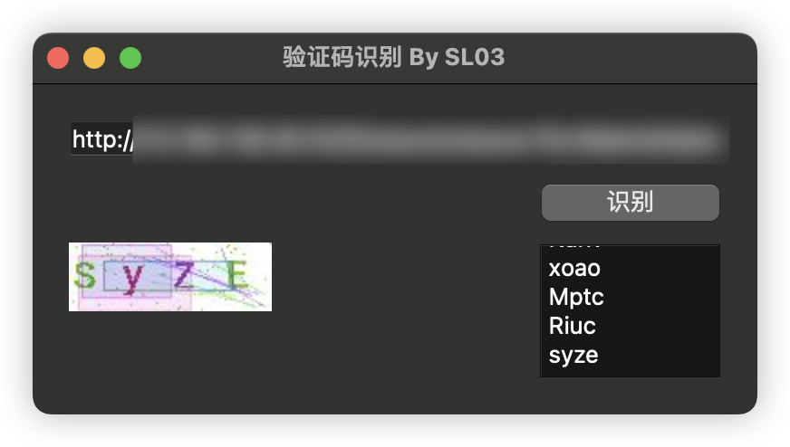

 # 一个简易的验证码识别工具
***
作为一个只会挖验证码可识别、用户名遍历这种垃圾洞的底层安服🌞，在换MAC之后发现之前的验证码识别工具只有exe的用不了，花了一个下午手搓了一个出来

在mac下支持根据系统设定的外观变化白色和黑色 <del>，我也不知道怎么实现的，应该是PYQT6自带</del>

识别引擎使用[ddddocr](https://github.com/sml2h3/ddddocr)

欢迎使用并指出bug